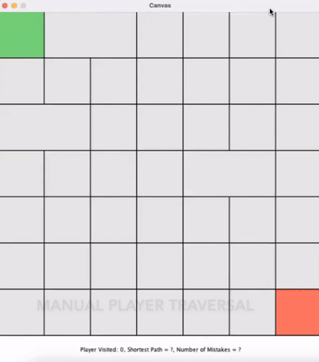

# Maze Animator
Random maze generator where user can manually traverse or watch a breadth-first or depth-first solution. Completed in May 2022 for Northeastern University's CS2510: Fundamentals of Computer Science Accelerated.

The program launches and then animates the construction of a random maze (Kruskal's algorithm is used to create a minimum spanning tree). After this, the user is able to navigate through the maze via arrow keys, or can watch BFS/DFS solutions via keyboard shortcuts. Statistics are kept to show which solution is optimal. Mazes can be randomly generated to have a preference for horizontal or vertical edges as specified by the user. The color scheme of the board can also be changed to see vertices based on either their distance from the start or distance from the end, where red signifies being close to the specified point and blue represents being far.

